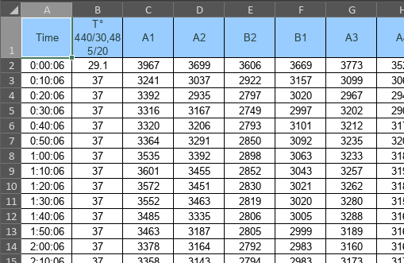

------------------------------------------------------------------------

## Setting Up

So the first thing we need to do is read our data from the .csv files and create R data objects (called "tibbles") out of them.

We begin by importing the `readr` library from the `tidyverse` package, which allows us to read various types of file formats easily.

We also import the `here` library, which allows us to interface easier with our filesystem.

Once we've done that, we will have access to the `read_csv()` and the `here()` functions.

- *`Library`--- a collection of prewritten functions.*

```{r}
library(readr)
library(here)
```

As you saw when we loaded the `here` library, `here()` simply prints a string containing our home directory:

```{r}
here()
```

Now that we have our tools all arranged, we need to take a look at our raw data and clean it up a bit.


### Data Cleaning

This is what our data looks like when we export it from gen5:




We want to clean this up because we don't want any extraneous data when manipulating our data objects.

Let's delete the unnecessary temperature column and save as `.csv` to remove the formatting.

Now our data is compatible with our `read_csv()` function.

### Importing Data

We need to tell R where our data is in our folder system. That means we should have a deliberately structured folder structure. For example, in this project, we have all saved data, processed or raw, in the `data` folder. We store data collected in the second round of collection in the folder `roundTwo`. And then we have our `XXX_YYY.csv` files containing our actual data.

We can pass strings into `here()` to specify specific folders of the home directory:

```{r}
here("data", "roundTwo", "rawData", "data.csv")
```


```{r}
here("foo", "bar", "thing.txt")
```

Let's use this feature to create a function which reads our data given a file name.

To define a function, we use the <- operator. Then we call it by writing the name of the function with parentheses and passing in the variables we want evaluated.

```{r}
some_function <- function(variable) {
      # do things here
}
```

```{r}
add_numbers <- function(a, b) {
      return(a + b)
}

add_numbers(1, 2)
```

Here is what a function to read from csv might look like:

```{r}
import_from_csv <- function(file, experiment) {
      data <- read_csv(
            here("data", "roundTwo", "rawData", file)
      )

      return_data <- read_csv(
            here("data", "roundTwo", "rawData", file),
            col_type = list(
                .default = col_double(),
                `Time` = "t"
                )
        ) %>%
        rename_and_reformat(exp_string) %>%
        normalize_by_commonfactor() %>%
        filter(!str_detect(grp, "25 PrLDm"))

    return(return_data)

}
```


